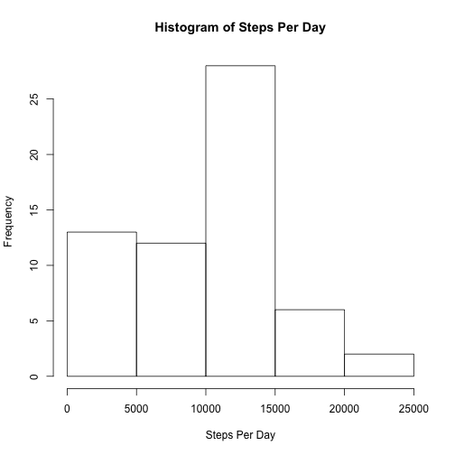
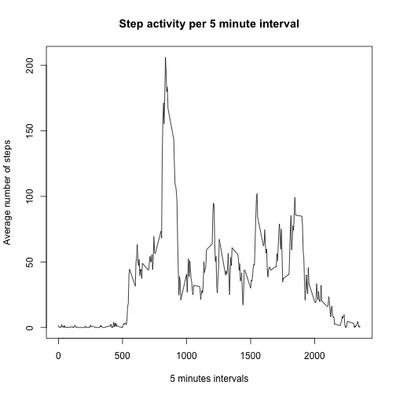
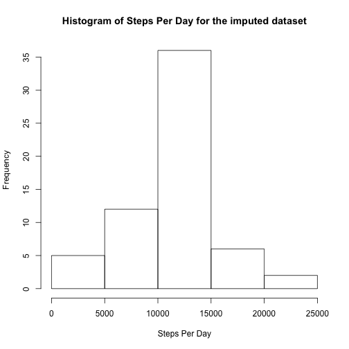
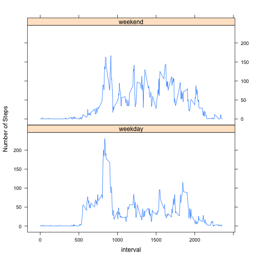

## Loading and preprocessing the data

```r
activity_data <- read.csv("activity.csv")
```

## What is mean total number of steps taken per day?

```r
# Calculate the total number of steps taken per day
steps_per_day <- with(activity_data, aggregate(steps, data.frame(date), sum, na.rm=TRUE))

# Plot a histogram with the total number of steps taken per day
hist(steps_per_day$x, xlab = "Steps Per Day", main = "Histogram of Steps Per Day")
```



```r
# Caluclate and report the mean and median number of steps taken per day
paste("The mean number of steps per day:", mean(steps_per_day$x, na.rm = TRUE))
```

```
## [1] "The mean number of steps per day: 9354.22950819672"
```

```r
paste("The median number of steps per day: ", median(steps_per_day$x, na.rm = TRUE))
```

```
## [1] "The median number of steps per day:  10395"
```

## What is the average daily activity pattern?

```r
# Calculate the avergage number of steps per interval
avg_steps_per_interval <- with(activity_data, aggregate(steps, data.frame(interval), mean, na.rm=TRUE))

# Plot the activity per interval
plot(avg_steps_per_interval, type="l", main = "Step activity per 5 minute interval",
     xlab = "5 minutes intervals",
     ylab = "Average number of steps")
```



## Imputing missing values

```r
# Total number of missing values (NAs)
paste("Total number of missing observations (NAs):", sum(is.na(activity_data$steps)))
```

```
## [1] "Total number of missing observations (NAs): 2304"
```

```r
# Copy the data_fram and impute the missing values (NAs) with the mean of that 5 minute interval
activity_data_imputed <- activity_data

for (i in 1:nrow(activity_data_imputed)) {
    if (is.na(activity_data_imputed$steps[i])) {
        interval = activity_data_imputed$interval[i]
        activity_data_imputed$steps[i] = avg_steps_per_interval[avg_steps_per_interval$interval==interval,]$x
    }
}

# Calculate the total number of steps taken per day
steps_per_day_imputed <- with(activity_data_imputed, aggregate(steps, data.frame(date), sum, na.rm=TRUE))

# Plot a histogram with the total number of steps taken per day
hist(steps_per_day_imputed$x, xlab = "Steps Per Day",
     main = "Histogram of Steps Per Day for the imputed dataset")
```



```r
# Caluclate and report the mean and median number of steps taken per day
paste("The mean number of steps per day for the imputed dataset:", mean(steps_per_day_imputed$x, na.rm = TRUE))
```

```
## [1] "The mean number of steps per day for the imputed dataset: 10766.1886792453"
```

```r
paste("The median number of steps per day for the imputed dataset: ", median(steps_per_day_imputed$x, na.rm = TRUE))
```

```
## [1] "The median number of steps per day for the imputed dataset:  10766.1886792453"
```

## Are there differences in activity patterns between weekdays and weekends?

```r
library("lattice")

# Create a new factor variable in the dataset
activity_data_imputed$wkd <- ifelse(weekdays(as.Date(activity_data_imputed$date, tz = "UTC")) %in% 
                                        c("Saturday", "Sunday"), "weekend", "weekday")
activity_data_imputed$wkd <- as.factor(activity_data_imputed$wkd)

# Calculate the average number of steps interval for weekends and weekdays
steps_per_interval_imputed <- with(activity_data_imputed, aggregate(steps, data.frame(interval, wkd), mean))

# Create a panel plot for the results for weekdays vs weekends
xyplot(x ~ interval | wkd, steps_per_interval_imputed, type = "l", layout = c(1,2), ylab = "Number of Steps")
```


